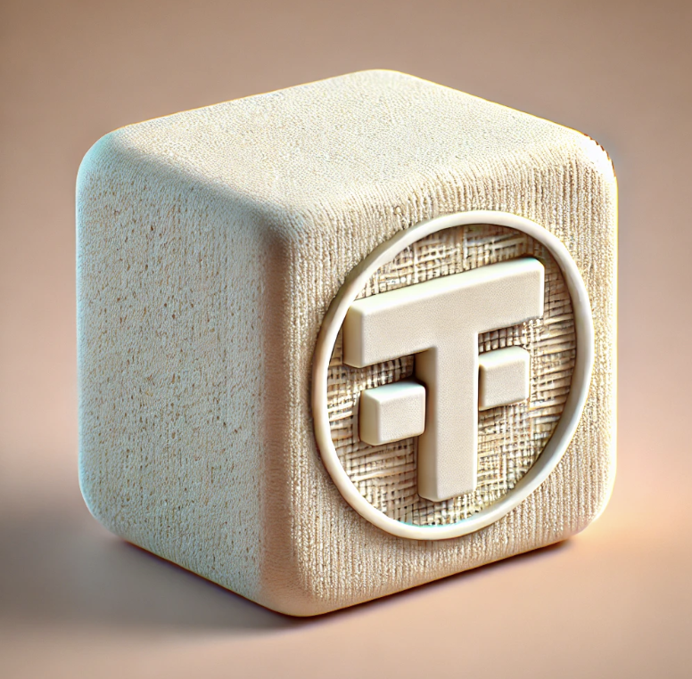

## TOFU Cross Chain Rebase Token



Note: This project is a practice exercise designed to explore and experiment with various Solidity concepts learned through the [Updraft Cyfrin](https://updraft.cyfrin.io/courses).

Developed an L1 Rebase Token that can be bridged to an L2 using [Chainlink CCIP](https://docs.chain.link/ccip).
- Protocol rewards early users with a higher interest which decreases over time.
- Developed a Vault that users can use to interact with the RebaseToken.
- Vault rewards are minted every time the user interacts with the protocol. The user's interest is updated with the current Vault's interest.
- If a user transfers tokens to another address, then the interest is inherited.
- Bridge to L2 is done using Chainlink CCIP.

## Usage

### Install

```shell
$ make install
```

### Test

```shell
$ make test
```

### Deploy and bridge tokens

Repository includes two scripts to interact with the protocol:

From Sepolia ETH to ZkSync Sepolia:
```shell
$ make deploy-and-bridge-sepolia-zksync
```

From Sepolia ETH to Arbitrum Sepolia:
```shell
$ make deploy-sepolia
```
